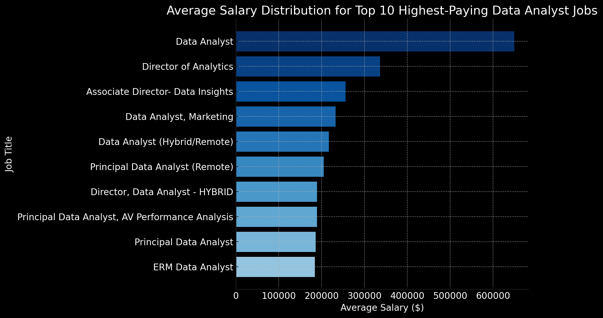
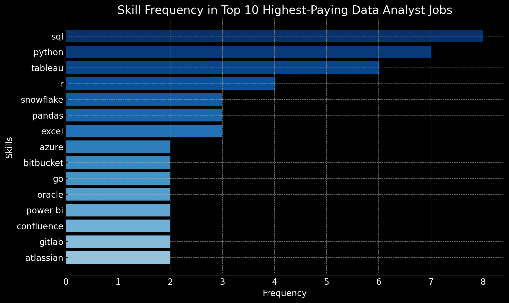

# Introduction
📊 Built to demystify the data analyst landscape, this project pinpoints the 💰 jobs that pay most, the 🔥 skills that are hottest, and the sweet spot where demand and salary align 📈.

🔍 SQL queries? Check them out here: [project_sql folder](/project_sql/)

# Background
Created to make the data analyst job hunt more efficient, this project was built to pinpoint the skills and roles that truly matter, helping myself and others streamline their search for the perfect job.

### The questions I wanted to answer through my SQL queries were:

1. What are the top-paying data analyst jobs?
2. What are the skills required for these top-paying jobs?
3. What skills are most in demand for data analysts?
4. Which skills are associated with higher salaries?
5. What are the most optimal skills to learn?

# Tools I Used
For my deep dive into the analyst job market, I harnessed the power of several key tools:

- **SQL:** The backbone of my analysis, allowing me to query the database and uncover critical insights.
- **PostgreSQL:** The chosen database management system, ideal for handling the job posting data.
- **Visual Studio Code:** My go-to for database management and executing SQL queries.
- **Git & GitHub:** Essential for version control and sharing my SQL scripts and analysis, ensuring collaboration and project tracking.

# The Analysis
Each query for this project was designed to uncover a precise insight into specific aspects of the data analyst job market. Here's how I approached each question:

### 1. Top Paying Data Analyst Jobs
To identify the top 10 highest-paying Data Analyst roles, I filtered the positions by average yearly salary and location, focusing on remote jobs.

```SQL
SELECT
    job_id,
    job_title,
    job_location,
    job_schedule_type,
    salary_year_avg,
    job_posted_date,
    name AS company_name
FROM
    job_postings_fact
LEFT JOIN company_dim USING(company_id)
WHERE
    job_title_short = 'Data Analyst' AND
    job_location = 'Anywhere' AND
    salary_year_avg IS NOT NULL 
ORDER BY
    salary_year_avg DESC
LIMIT 10;
```
Here's the breakdown of the top data analyst jobs in 2023:
- **Wide Salary Range:** Analyst pay stretches from ~$184K to an outlier at $650K, showing both huge earning potential and big variability depending on company and role.

- **Diverse Employment:** High-paying roles span industries like tech (Meta, Pinterest), healthcare (UCLA), finance (SmartAsset), telecom (AT&T), and even startups (Mantys).

- **Job Title Variety:** Titles range from standard “Data Analyst” to leadership roles like “Director” and “Principal,” highlighting multiple career paths into top-paying positions.


*Bar graph visualizing the salary for the top 10 salaries for data analysts; ChatGPT generated this graph from my SQL query results.*

### 2. Skills For Top Paying Jobs
To understand the skills required for those top-paying jobs, I joined the job postings to the skills data table, uncovering insights about skills to develop that align with top salaries.
```SQL
WITH top_paying_jobs AS (
    SELECT
        job_id,
        job_title,
        salary_year_avg,
        name AS company_name
    FROM
        job_postings_fact
    LEFT JOIN company_dim USING(company_id)
    WHERE
        job_title_short = 'Data Analyst' AND
        job_location = 'Anywhere' AND
        salary_year_avg IS NOT NULL 
    ORDER BY
        salary_year_avg DESC
    LIMIT 10
)

SELECT
    top_paying_jobs.*,
    skills
FROM top_paying_jobs
INNER JOIN skills_job_dim USING(job_id)
INNER JOIN skills_dim USING(skill_id)
ORDER BY
    salary_year_avg DESC
```
Here's the breakdown of the most demanded skills for the top 10 highest-paying data analysts in 2023, based on job postings:
- **SQL** is leading with a bold count of 8.
- **Python** follows closely with a bold count of 7.
- **Tableau** is also highly sought after, with a bold count of 6. Other skills like **R**, **Snowflake**, **Pandas**, and **Excel** show varying degrees of demand.


*Bar graph visualizing the count of skills for the top 10 jobs by salary for data analysts; ChatGPT generated this graph from my SQL query results.*

### 3. In-Demand Skills For Remote Data Analyst
To identify the top 5 skills wih the highest demand in the job postings.
```SQL
SELECT
    skills,
    COUNT(*) AS demand_count
FROM job_postings_fact
INNER JOIN skills_job_dim USING(job_id)
INNER JOIN skills_dim USING(skill_id)
WHERE
    job_title_short = 'Data Analyst' AND
    job_work_from_home = True
GROUP BY
    skills
ORDER BY
    demand_count DESC
LIMIT 5;
```
Here's the breakdown of the most in-demand skills for data analyts:
- **SQL** dominates demand, showing database skills are essential, while **Excel** and **Python** remain crucial for both basic and advanced data analysis.
- Visualization tools like **Tableau** and **Power BI** are key, emphasizing the importance of effectively communicating insights.

| Skill    | Demand Count |
|----------|--------------|
| SQL      | 7,291        |
| Excel    | 4,611        |
| Python   | 4,330        |
| Tableau  | 3,745        |
| Power BI | 2,609        |
*Table of the count for the top 5 most in-demand skills of data analysts.*

### 4. Top Paying Skills
This query identifies the top skills based on salary to provide insights on the most rewarding skills to acquire or improve.
```SQL
SELECT
    skills,
    ROUND(AVG(salary_year_avg),0) AS avg_salary
FROM job_postings_fact
INNER JOIN skills_job_dim USING(job_id)
INNER JOIN skills_dim USING(skill_id)
WHERE
    job_title_short = 'Data Analyst' AND
    salary_year_avg IS NOT NULL AND
    job_work_from_home = True
GROUP BY
    skills
ORDER BY
    avg_salary DESC
LIMIT 25;
```
Here's a breakdown of the results for the top paying skills
- **Big Data and Engineering Skills Pay the Most:** The highest-paying skills are focused on big data processing and engineering, such as **PySpark** and **Databricks**.

- **DevOps and Collaboration Tools are Key:** High salaries are also linked to proficiency in DevOps and version control tools like **Bitbucket**, **GitLab**, and **Jenkins**, indicating a strong demand for collaboration skills.

- **Cloud, Infrastructure, and Machine Learning Skills are Gaining Value:** Expertise in cloud platforms and infrastructure, including **Kubernetes** and **GCP**, along with machine learning libraries like **scikit-learn**, also appears frequently among the top-paying skills.

| Skill         | Avg Salary (USD) |
|---------------|------------------|
| pyspark       | 208,172          |
| bitbucket     | 189,155          |
| couchbase     | 160,515          |
| watson        | 160,515          |
| datarobot     | 155,486          |
| gitlab        | 154,500          |
| swift         | 153,750          |
| jupyter       | 152,777          |
| pandas        | 151,821          |
| elasticsearch | 145,000          |
| golang        | 145,000          |
| numpy         | 143,513          |
| databricks    | 141,907          |
| linux         | 136,508          |
| kubernetes    | 132,500          |
| atlassian     | 131,162          |
| twilio        | 127,000          |
| airflow       | 126,103          |
| scikit-learn  | 125,781          |
| jenkins       | 125,436          |
| notion        | 125,000          |
| scala         | 124,903          |
| postgresql    | 123,879          |
| gcp           | 122,500          |
| microstrategy | 121,619          |
*Table of the top 25 highest paying data analyst skills based on salary.*

### 5. The Optimal Skills to Learn Based on Demand and Salary
To identify the sweet spot where demand meets high salary, this query combines the insights from the demand and salary data.
```SQL
SELECT
    skills_dim.skill_id,
    skills_dim.skills,
    COUNT(skills_job_dim.job_id) AS demand_count,
    ROUND(AVG(job_postings_fact.salary_year_avg),0) AS avg_salary
FROM job_postings_fact
INNER JOIN skills_job_dim USING(job_id)
INNER JOIN skills_dim USING(skill_id)
WHERE
    job_title_short = 'Data Analyst'
    AND salary_year_avg IS NOT NULL
    AND job_work_from_home = True
GROUP BY
    skills_dim.skill_id
HAVING 
    COUNT(skills_job_dim.job_id) > 10
ORDER BY
    demand_count DESC,
    avg_salary DESC
LIMIT 25;
```
Here's the breakdown for the results of the most optimal skills
- **Cloud is King:** The highest-paying skills are in cloud and big data, with Go($115,320 avg.), Snowflake (37 demand count), and Azure (34 demand count) all topping the list.
- **Foundation with High Demand:** While their salaries are slightly lower, Python and R have a massive demand count, making them essential for getting a foothold in the high-paying job market.
- **Specialization is Valuable:** Lower-demand skills like Looker ($103,795 avg.) and Jira ($104,918 avg.) still command high salaries, proving that niche expertise can be very lucrative.

| Skill      | Demand Count | Avg Salary (USD) |
|------------|--------------|------------------|
| go         | 27           | 115,320          |
| confluence | 11           | 114,210          |
| hadoop     | 22           | 113,193          |
| snowflake  | 37           | 112,948          |
| azure      | 34           | 111,225          |
| bigquery   | 13           | 109,654          |
| aws        | 32           | 108,317          |
| java       | 17           | 106,906          |
| ssis       | 12           | 106,683          |
| jira       | 20           | 104,918          |
| oracle     | 37           | 104,534          |
| looker     | 49           | 103,795          |
| nosql      | 13           | 101,414          |
| python     | 236          | 101,397          |
| r          | 148          | 100,499          |
*Table of the most optimal skills for data analysts sorted by salary.*

# What I Learned

On this ride, I supercharged my SQL game with:

- **📊 Data Aggregation:** Using GROUP BY and aggregate functions like COUNT() and AVG() to summarize data effortlessly.
- **🧩 Complex Query Crafting:** Cracked complex joins and WITH clauses like a pro.
- **💡 Analytical Wizardly:** Leveled up my analytical skills to turn raw data into actionable, insightful SQL queries.

# Conclusions

### Insights
From the analysis, several key insights emerged:

1. **Top-Paying Data Analyst Roles:** The highest-paying data analyst jobs can offer salaries up to $650,000.
2. **The Power of SQL:** SQL is a non-negotiable skill, leading both in-demand count and its association with top salaries, making it essential for any data analyst seeking to maximize their market value.
3. **Niche Expertise:** While foundational skills are key, the data shows that mastering specialized, high-value skills can significantly boost earning potential.

### Closing Thoughts
This project elevated my SQL skills and revealed how technical skills map to real-world opportunities. My biggest takeaway is: mastering high-demand skills while staying adaptable is the surest path to growth in data analytics.